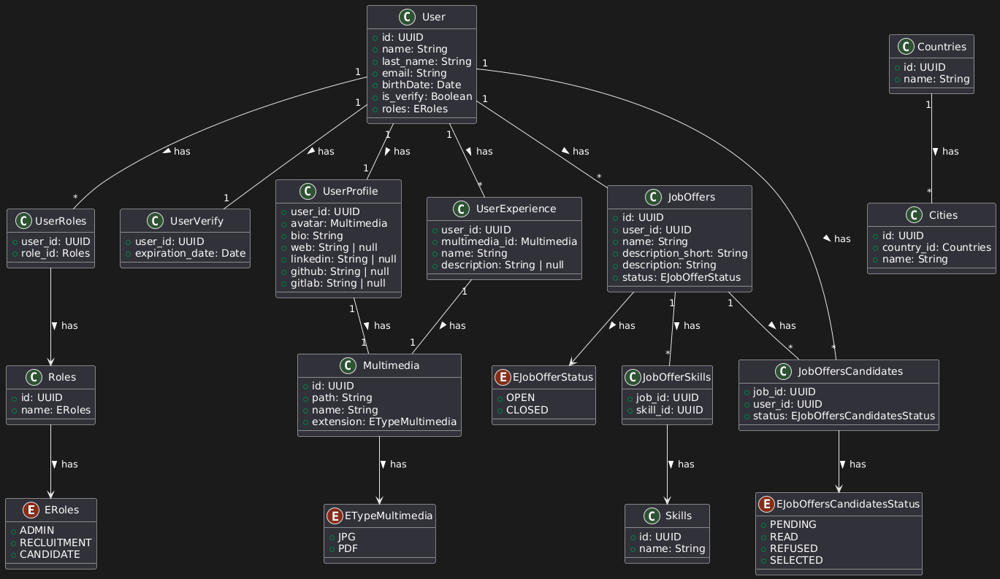
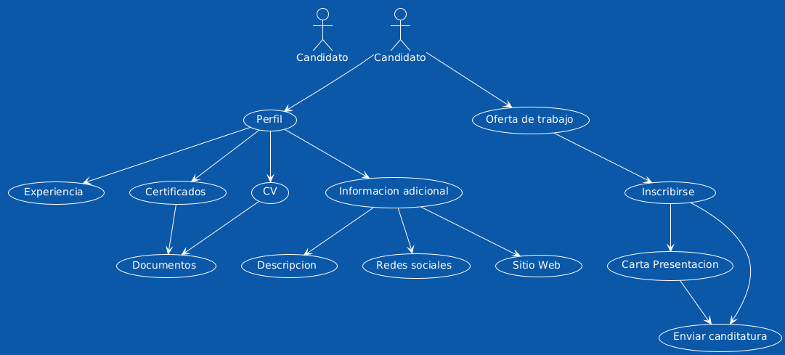

#NestJS + JWT + Roles Manager (RBAC)





### Commands Inject roles
```sql
-- Insertar rol ADMIN
INSERT INTO roles (id, name)
VALUES ('123e4567-e89b-12d3-a456-426614174000', 'ADMIN');

-- Insertar rol RECRUITMENT
INSERT INTO roles (id, name)
VALUES ('123e4567-e89b-12d3-a456-426614174001', 'EMPLOYER');

-- Insertar rol CANDIDATE
INSERT INTO roles (id, name)
VALUES ('123e4567-e89b-12d3-a456-426614174002', 'USER');
```